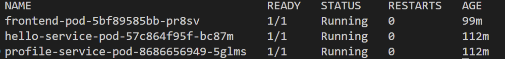
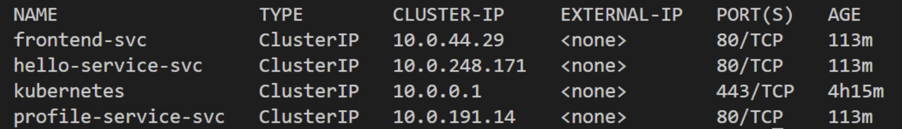
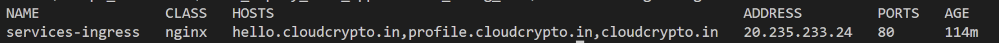
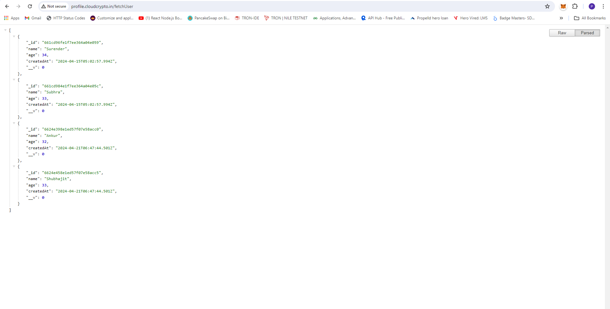
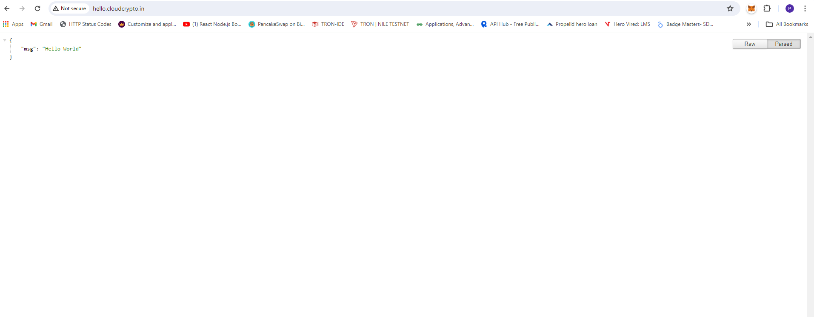
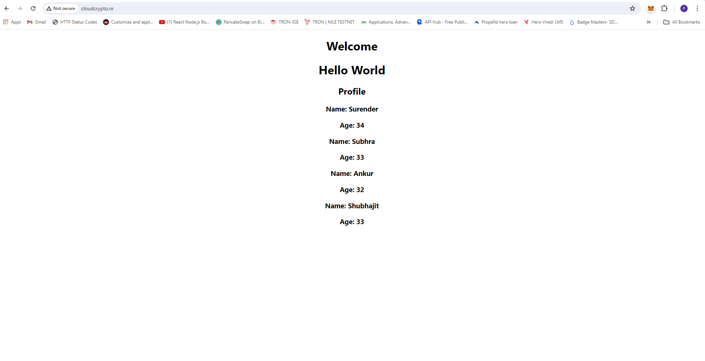
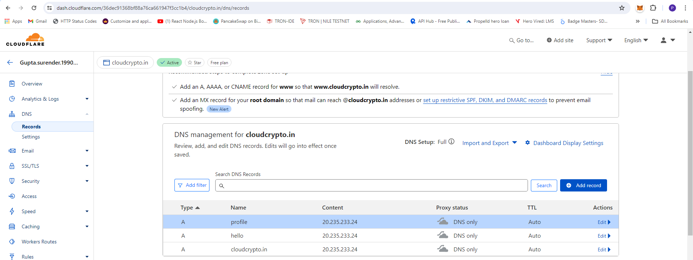
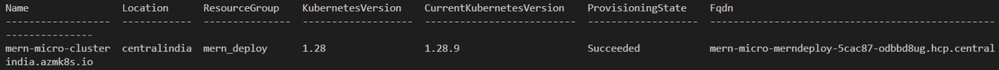
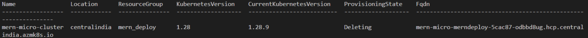

# Deploying a MERN (MongoDB, Express.js, React, Node.js) Application using Google Kubernetes Service (GKS)

This guide walks you through deploying a MERN application using Google Kubernetes Service (GKS).

## Prerequisites
1. **Google Account**: Ensure you have a Google account.
2. **Google CLI**: Install the Google CLI.
3. **kubectl**: Install kubectl for managing Kubernetes clusters.
4. **Docker**: Install Docker for containerizing the application.
5. **Git**: Install Git for version control.

---

## Deployment Guide

### Step 1: Clone the Git Repository
```bash
git clone https://github.com/UnpredictablePrashant/SampleMERNwithMicroservices.git
```

---

## Step 2: Update the `Home.js` Controller
```javascripts
const helloServiceUrl = process.env.REACT_APP_SERVICE1_URL;
const profileServiceUrl = process.env.REACT_APP_SERVICE2_URL;

useEffect(() => {
  axios
    .get(helloServiceUrl) // Update the URL: http://localhost:3001/
    .then((response) => setMessage(response.data.msg))
    .catch((error) => console.error("Error fetching data:", error));
}, []);

useEffect(() => {
  axios
    .get(`${profileServiceUrl}fetchUser`) // Update the URL: http://localhost:3002/fetchUser
    .then((response) => setProfile(response.data))
    .catch((error) => console.error("Error fetching data:", error));
}, []);
```

---

## Step 3: Create Dockerfiles for Frontend and Backend Microservices

- Dockerfile for Hello Service

```Dockerfile
FROM node:18

WORKDIR /app

COPY package*.json ./

RUN npm install

COPY . .

EXPOSE 3001

CMD ["node", "index.js"]
```

- Dockerfile for Profile Service
```Dockerfile
FROM node:20

WORKDIR /app

COPY package*.json ./

RUN npm install

COPY . .

EXPOSE 3002

CMD ["node", "index.js"]

```

- Dockerfile for Frontend
```Dockerfile
FROM node:18

WORKDIR /app

COPY package*.json ./

RUN npm install

COPY . .

EXPOSE 3000

CMD ["npm", "start"]

```

---

## Step 4: Build and Push Docker Images
```bash
docker build -t simple_mearn_be_micro_1 .
docker build -t simple_mearn_be_micro_2 .
docker build -t simple_mern_micro_fe .

docker tag simple_mearn_be_micro_1 yourdockerhub/simple_mearn_be_micro_1:latest
docker tag simple_mearn_be_micro_2 yourdockerhub/simple_mearn_be_micro_2:latest
docker tag simple_mern_micro_fe yourdockerhub/simple_mern_micro_fe:latest

docker push yourdockerhub/simple_mearn_be_micro_1:latest
docker push yourdockerhub/simple_mearn_be_micro_2:latest
docker push yourdockerhub/simple_mern_micro_fe:latest
```

---

## Step 5: Open Terminal and Login
```bash
gcloud auth login
```

---

## Step 6: Create Resource Group and Register Resource Provider
```
Enable the following services in Google Cloud:
- Compute Engine
- Kubernetes Engine
- Container Registry
- Stackdriver Kubernetes Monitoring
```

---

## Step 7: Create GKS Cluster
```bash
gcloud container clusters create mern-micro-cluster \
  --zone us-central1-a \
  --num-nodes 2 \
  --enable-stackdriver-kubernetes
```

---

## Step 8: Kubectl command enable
```bash
gcloud container clusters get-credentials mern-micro-cluster --zone us-central1-a
```

---

## Step 9: Install NGINX Ingress Controller
```bash
kubectl apply -f https://raw.githubusercontent.com/kubernetes/ingress-nginx/main/deploy/static/provider/cloud/deploy.yaml
```

---


## Step 10: Run Deployment, services as manifest file and Ingress file
```bash
kubectl apply -f ./manifest.yaml
kubectl apply -f ./ingress.yaml
```

---

## Step 11: Verify Ingress, Deployment, services
```bash
kubectl get ingress
kubectl get pod
kubectl get svc
```

---

## Step 12: Update DNS A Records
```text
NAME               CLASS   HOSTS                                                        ADDRESS         PORTS   AGE
services-ingress   nginx   hello.cloudcrypto.in,profile.cloudcrypto.in,cloudcrypto.in   20.235.233.24   80      89m

#COPY IP FROM GET INGRESS COMMAND 
```

---

## Step 13: Deployment Done With AKS

## Screenshot

















---

# Project Teardown Guide
This guide provides the steps to delete all resources created for the project on Azure, including deployments, services, and the Azure Kubernetes Service (AKS) cluster.

## Prerequisites

- Google CLI installed
- Access to the GCP account with necessary permissions
- `kubectl` configured to interact with the GKS cluster

---

## Step-by-Step Instructions

### Step 1: Delete Kubernetes Deployments

First, delete the Kubernetes deployments for the services:

```bash
kubectl delete deployment hello-service-pod
kubectl delete deployment profile-service-pod
kubectl delete deployment frontend-pod
```

---

### Step 2: Delete Kubernetes Services

Next, delete the Kubernetes services associated with the deployments:

```bash
kubectl delete service hello-service-svc
kubectl delete service profile-service-svc
kubectl delete service frontend-svc
```

---

### Step 3: Verify Deletion

To ensure that all deployments and services have been deleted, you can list the remaining deployments and services:

```bash
kubectl get deployments
kubectl get services
kubectl get ingress
```

---

### Step 4: Delete the GKS Cluster
Now, delete the GKS cluster. Replace <resource-group-name> and <gks-cluster-name> with the appropriate values.

```bash
gcloud container clusters delete mern-micro-cluster --zone us-central1-a --quiet
```

---

### Step 5: Verify GKS Cluster Deletion

```bash
gcloud container clusters list
```

---




